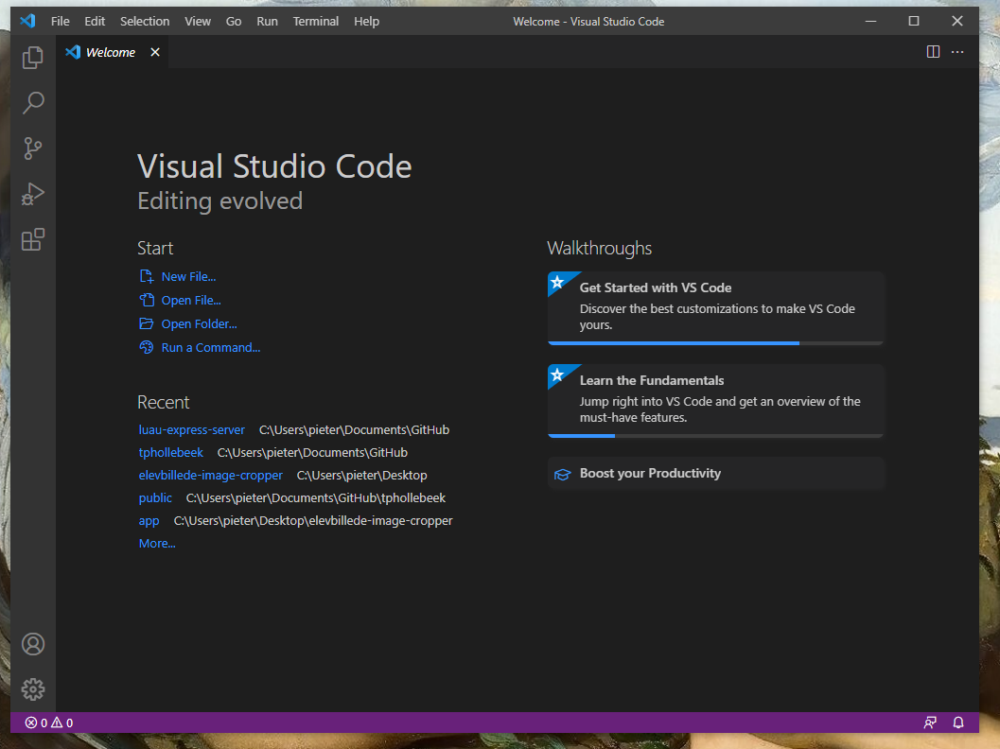
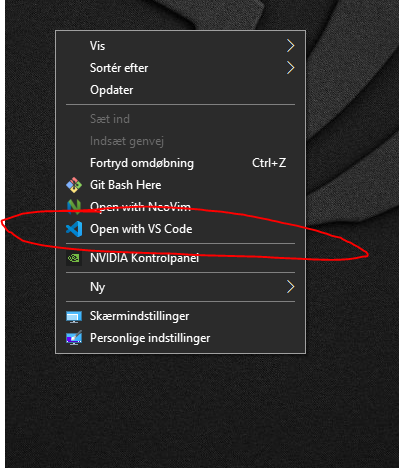

[Go back](index.md)

# How to download Visual Studio Code - VSCode

## On Windows

1. Go to [VSCode website](https://code.visualstudio.com/).
2. Click **Download for Windows** *Stable Build*
3. Save and open installer
4. Go through the wizard thoroughly
5. When asked if you want to add `Open/Edit with VSCode` to the context menu, i recommend selecting yes
6. When finished, start VSCode

If done correctly, it should look something like this:

And if you said yes to adding `Open/Edit with VSCode`, it should look something like this:

[Go back](index.md)
